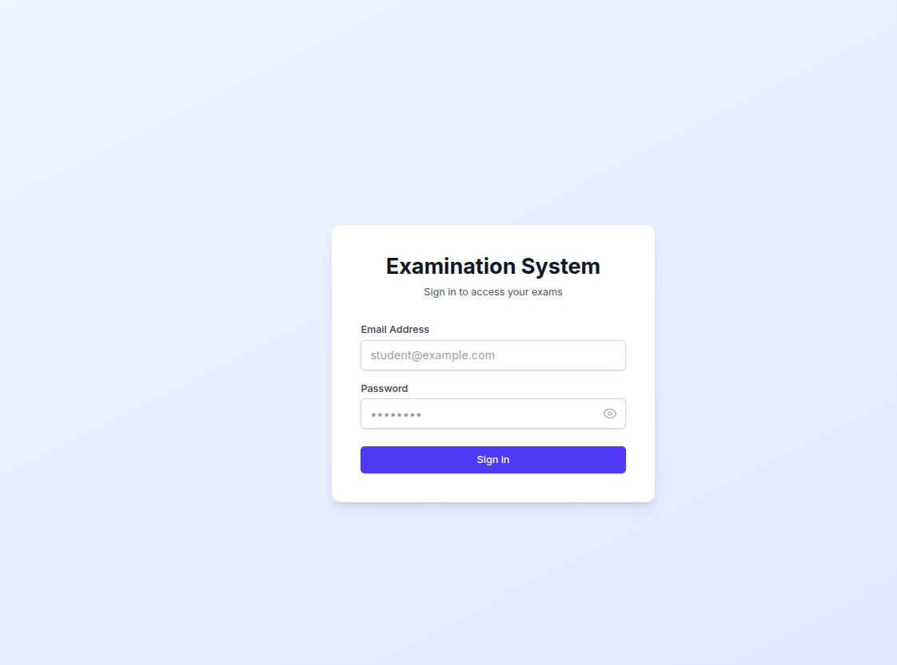
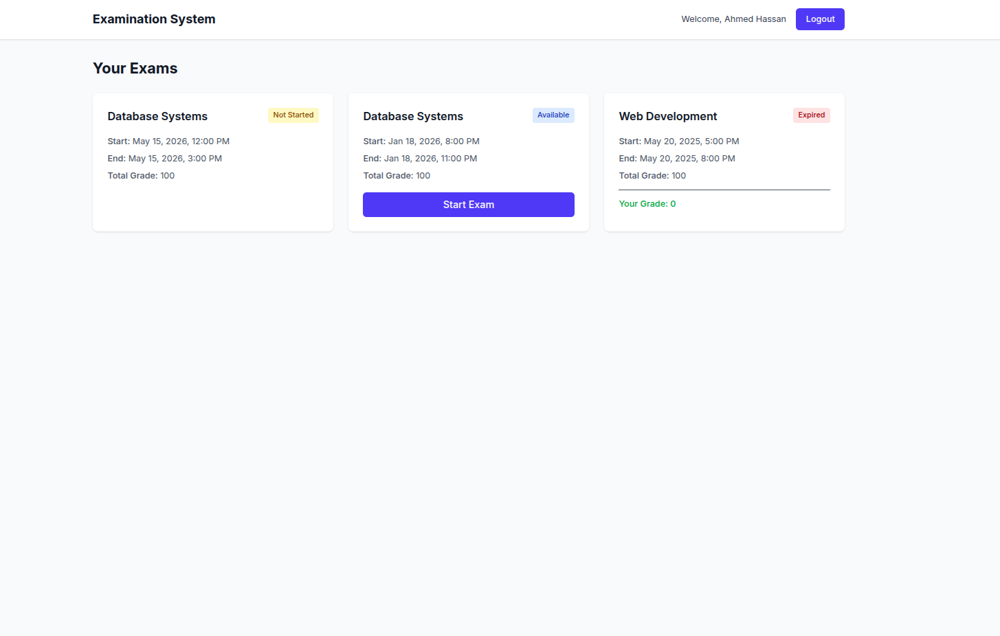
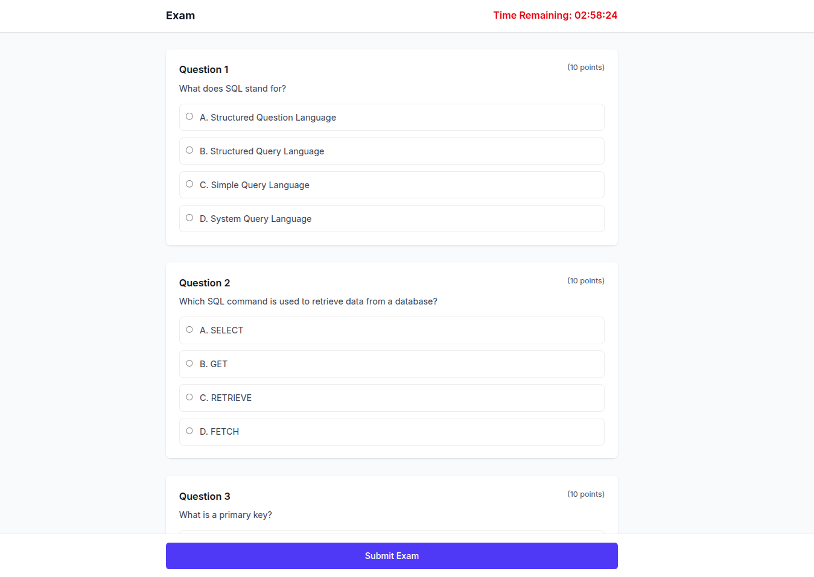
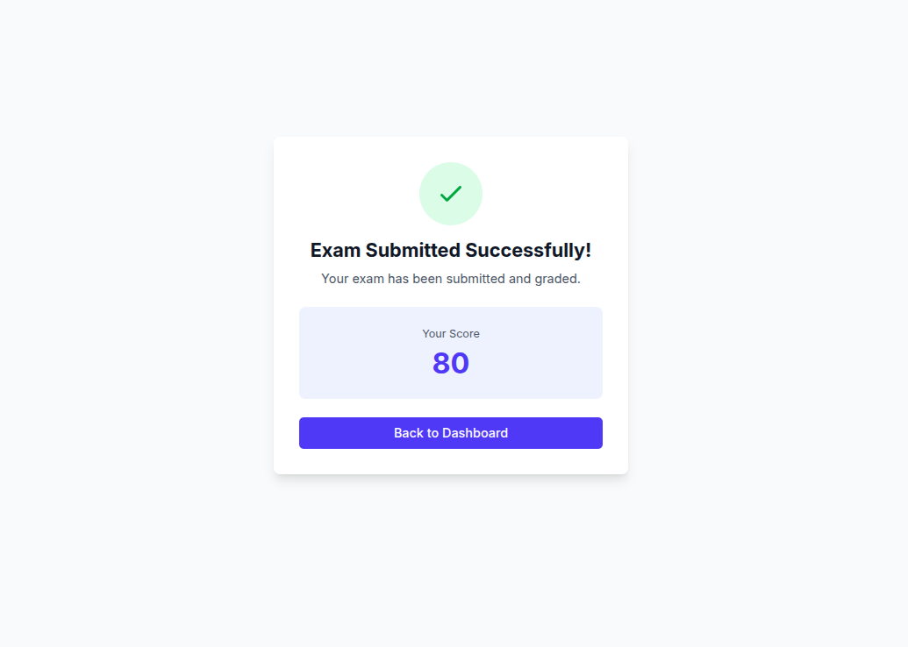
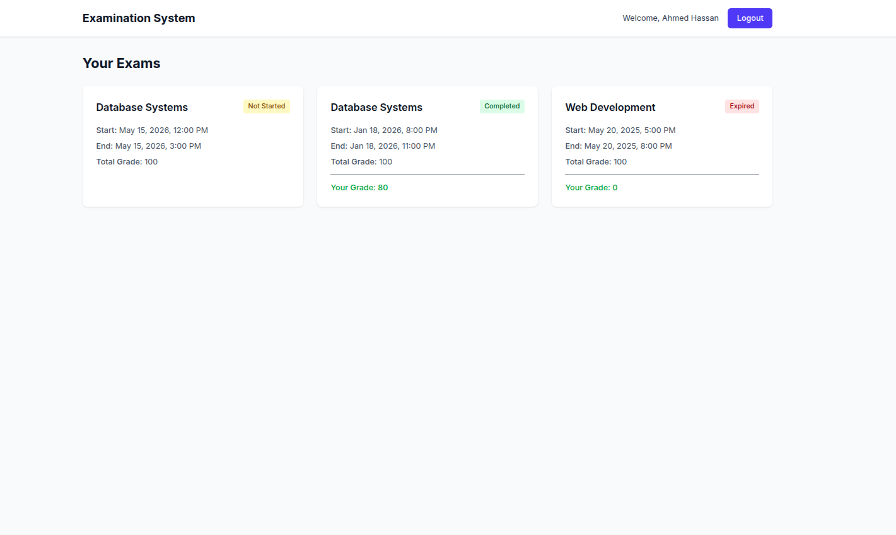

# 📚 Examination System

A modern, full-stack online examination system built with Next.js 14, TypeScript, and SQL Server. This system allows students to take timed exams with automatic grading and real-time countdown timers.


## ✨ Features

- 🔐 **Secure Authentication** - JWT-based authentication with HTTP-only cookies
- ⏱️ **Timed Exams** - Real-time countdown timer with auto-submit functionality
- 📊 **Automatic Grading** - Instant results after exam submission
- 🎯 **Access Control** - Time-based exam availability (start/end time enforcement)
- 📱 **Responsive Design** - Works seamlessly on desktop, tablet, and mobile
- 🎨 **Modern UI** - Clean interface built with Tailwind CSS
- 🔒 **Type-Safe** - Full TypeScript implementation
- 💾 **SQL Server Integration** - Robust database backend

## 🚀 Demo

### Login Page
Students authenticate using their email credentials.

### Dashboard
View all assigned exams with their status (Available, Not Started, Expired, Completed).

### Exam Interface
Take exams with real-time countdown, MCQ and True/False questions support.

### Results
Instant grade display upon submission.

## 🛠️ Tech Stack

**Frontend:**
- [Next.js 14](https://nextjs.org/) - React Framework with App Router
- [TypeScript](https://www.typescriptlang.org/) - Type Safety
- [Tailwind CSS](https://tailwindcss.com/) - Styling
- [React Countdown](https://www.npmjs.com/package/react-countdown) - Timer Component
- [date-fns](https://date-fns.org/) - Date Formatting

**Backend:**
- [Next.js API Routes](https://nextjs.org/docs/app/building-your-application/routing/route-handlers) - RESTful API
- [node-mssql](https://www.npmjs.com/package/mssql) - SQL Server Driver
- [jsonwebtoken](https://www.npmjs.com/package/jsonwebtoken) - JWT Authentication
- [bcryptjs](https://www.npmjs.com/package/bcryptjs) - Password Hashing (ready for implementation)

**Database:**
- Microsoft SQL Server 2019+

## 📋 Prerequisites

Before you begin, ensure you have the following installed:

- **Node.js** 18.x or higher
- **npm** or **yarn**
- **SQL Server** 2019 or higher
- **Git** for version control

## 🔧 Installation

### 1. Clone the Repository

```bash
git clone https://github.com/hussainmansour/examination-system.git
cd examination-system
```

### 2. Install Dependencies

```bash
npm install
```

### 3. Database Setup

Run the following SQL script to create the database schema:

```sql
USE master;
GO

CREATE DATABASE Examination_System;
GO

USE Examination_System;
GO

-- Run the complete schema from database-schema.sql and database_storedProcedures.sql
-- (See database-schema.sql file in the repository)
```

### 4. Environment Configuration

Create a `.env.local` file in the root directory:

```env
# Database Configuration
DB_USER=your_database_username
DB_PASSWORD=your_database_password
DB_SERVER=localhost
DB_NAME=Examination_System

# JWT Secret (use a strong random string in production)
JWT_SECRET=your-super-secret-jwt-key-change-this-in-production
```

### 5. Run Development Server

```bash
npm run dev
```

Open [http://localhost:3000](http://localhost:3000) in your browser.

## 📁 Project Structure

```
examination-system/
├── src/
│   ├── app/
│   │   ├── api/                    # API Routes
│   │   │   ├── auth/
│   │   │   │   └── login/
│   │   │   │       └── route.ts   # Login endpoint
│   │   │   └── exams/
│   │   │       ├── route.ts       # Get all exams
│   │   │       └── [id]/
│   │   │           ├── questions/ # Get exam questions
│   │   │           └── submit/    # Submit exam
│   │   ├── dashboard/
│   │   │   └── page.tsx           # Student dashboard
│   │   ├── exam/
│   │   │   └── [id]/
│   │   │       └── page.tsx       # Exam taking interface
│   │   ├── layout.tsx             # Root layout
│   │   ├── page.tsx               # Login page
│   │   └── globals.css            # Global styles
│   ├── lib/
│   │   └── db.ts                  # Database connection
│   └── types/
│       └── index.ts               # TypeScript types
├── public/                         # Static assets
├── .env.local                      # Environment variables (not in repo)
├── next.config.js                  # Next.js configuration
├── tailwind.config.ts              # Tailwind configuration
├── tsconfig.json                   # TypeScript configuration
└── package.json                    # Dependencies
```

## 🔑 API Endpoints

### Authentication

| Method | Endpoint | Description |
|--------|----------|-------------|
| POST | `/api/auth/login` | Student login |

### Exams

| Method | Endpoint | Description |
|--------|----------|-------------|
| GET | `/api/exams` | Get all exams for logged-in student |
| GET | `/api/exams/[id]/questions` | Get questions for specific exam |
| POST | `/api/exams/[id]/submit` | Submit exam answers |

## 💡 Usage

### For Students

1. **Login** - Use your email and password to access the system
2. **View Exams** - See all assigned exams on the dashboard
3. **Take Exam** - Click "Start Exam" when available (within time window)
4. **Submit** - Answer questions and submit before time expires
5. **View Results** - See your grade immediately after submission

### Exam Status Indicators

- 🟡 **Not Started** - Exam hasn't begun yet
- 🔵 **Available** - Exam is currently available to take
- 🔴 **Expired** - Exam time has passed
- 🟢 **Completed** - You've already taken this exam

## 🔒 Security Features

- ✅ JWT-based authentication
- ✅ HTTP-only cookies
- ✅ Parameterized SQL queries (SQL injection prevention)
- ✅ Time-based access control
- ✅ Server-side validation
- ✅ Password hashing 
## 📝 Database Schema

The system uses the following main tables:

- **STUDENT** - Student information
- **EXAMS** - Exam details
- **QUESTIONS** - Question bank
- **CHOICES** - MCQ choices
- **STUDENT_EXAM** - Student-exam assignments
- **STUDENT_ANSWERS** - Student responses
- **EXAM_QUESTIONS** - Exam-question mappings

For complete schema, see `database-schema.sql`.

Made with ❤️ by 

Rana Alaa   

Mariam AlaaEldin 

Omar Tammam 

Hussien Mohamed

Marwan Essam

Sohaila Esmat 
 
## 🖼️ Screenshots
<table>
<tr>
<td></td>
<td></td>
</tr>
<tr>
<td></td>
<td></td>
</tr>
  <tr>
<td></td>
</tr>
</table>
